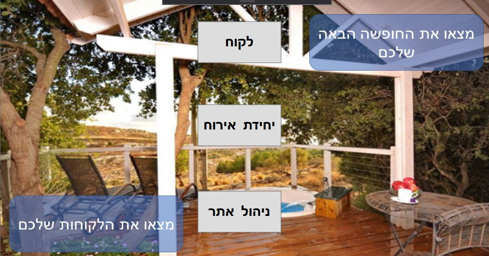

# Project_CSH - Draft

#Start working 
You should run the project from PLWPF.

 
From this GUI you can access 3 sub-menus:
1.	Client – create guest request which includes all the element of the request
2.	Hosting-unit – menu for hosting units owners, in it you can create Hosting-unit or manage your orders (sending email to the client) in the personal area
3.	Admin – menu for all the data in the program.
Other cool stuff:
-	The progrem downloads every day the Israeli ATM's data and checks the data in the by it

